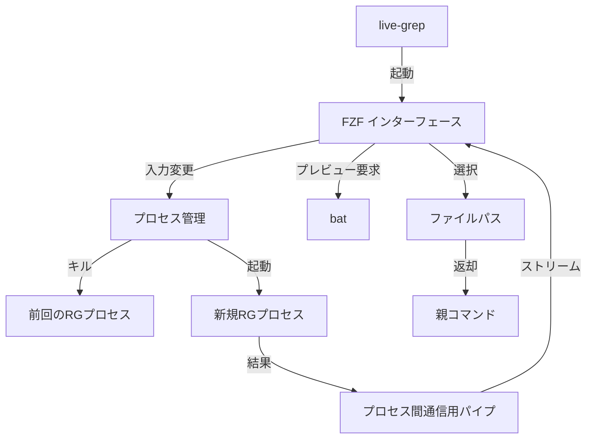
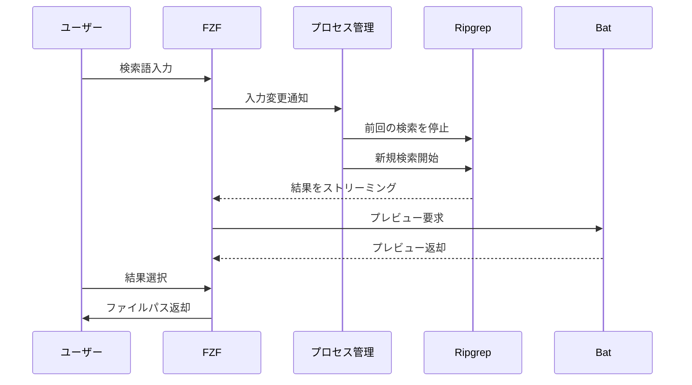

# live-grep-bash 実装計画

## 概要

fzf、ripgrep、batを組み合わせて、リアルタイムなファイル内容検索を実現する対話的なコマンドラインツール

## コマンドライン引数

```bash
live-grep [options] [paths...]

Options:
  -p, --pattern PATTERN    検索対象のファイルパターン (例: "*.rs")
  -d, --depth DEPTH       検索の深さ (デフォルト: 無制限)
  -c, --context LINES     プレビュー時の前後の表示行数 (デフォルト: 2)
  -e, --exclude PATTERN   除外するファイルパターン
  -h, --help             ヘルプを表示
```

## システム構成



## コンポーネント詳細

### 1. メインスクリプト (live-grep)

- 一時ディレクトリとプロセス間通信の設定
- シグナルハンドリングの設定
- fzfの設定とオプション管理
- コマンドライン引数のパース

### 2. プロセス管理

- バックグラウンドでのrg実行
- プロセスIDの追跡
- 新しい検索時の古いプロセスの終了

### 3. 検索処理



## 実装手順

1. **基本構造の実装**
   - シェルスクリプトの基本構造作成
   - コマンドライン引数処理の実装
   - 一時ディレクトリ管理の実装

2. **プロセス管理の実装**
   - プロセス追跡メカニズムの実装
   - シグナルハンドラーの実装
   - クリーンアップ処理の実装

3. **検索処理の実装**
   - rgコマンドの構築
   - 結果の出力処理
   - バックグラウンドプロセス管理

4. **FZFインテグレーション**
   - fzfの設定
   - プレビュー機能の実装
   - 結果のフォーマット処理

## エラーハンドリング

- 必要なコマンド（fzf、rg、bat）の存在チェック
- 一時ディレクトリ作成失敗時の処理
- 不正なコマンドライン引数のバリデーション
- プロセス終了時のクリーンアップ確認

## テスト計画

1. **ユニットテスト**
   - コマンドライン引数のパース
   - パターンマッチングの動作
   - プロセス管理の正常動作

2. **統合テスト**
   - 実際の検索シナリオ
   - 大規模ディレクトリでのパフォーマンス
   - エラーケースの動作確認

## パフォーマンス考慮事項

- 大規模ディレクトリでの検索速度の最適化
- メモリ使用量の監視と制御
- プロセス切り替えのオーバーヘッド最小化
